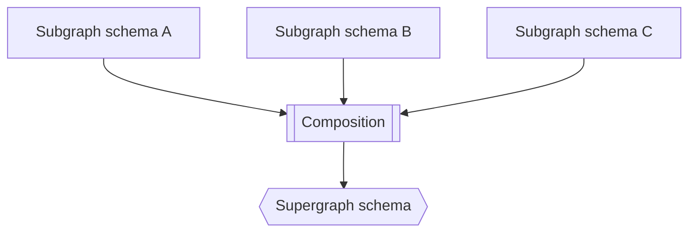

# Apollo Federation Guide

## 1. Introduction to Federation

Apollo Federation is an architecture for orchestrating multiple APIs into a single GraphQL API. It enables declarative combination of APIs through a centralized router.

### Architecture Overview


Clients interact with a single entry point (router) that intelligently orchestrates and distributes requests across your APIs.

### Multiple API Problem
Before federation:


After federation:


### Supergraph Structure


## 2. Core Benefits

### Microservices Architecture
- Enables team autonomy
- Supports independent service deployment
- Facilitates distributed development

### Client Simplicity
- Single endpoint for all queries
- No client-side configuration needed
- Optimized request handling

### Schema Management
- No namespace restrictions
- Native type relationships
- Direct team contributions

## 3. Schema Types in Federation

### Subgraph Schemas
```graphql
type Query {
  me: User
}

type User @key(fields: "id") {
  id: ID!
  username: String! @shareable
}

extend schema
  @link(url: "https://specs.apollo.dev/federation/v2.3",
        import: ["@key", "@shareable"])
```

### Supergraph Schema
```graphql
schema
  @link(url: "https://specs.apollo.dev/link/v1.0")
  @link(url: "https://specs.apollo.dev/join/v0.3", for: EXECUTION)
{
  query: Query
}

type Product
  @join__type(graph: PRODUCTS, key: "upc")
  @join__type(graph: REVIEWS, key: "upc")
{
  upc: String!
  name: String!
  price: Int
}
```

### API Schema
```graphql
type Product {
  name: String!
  price: Int
  reviews: [Review]
  upc: String!
}
```

## 4. Schema Composition

### Process Overview


### Composition Methods
1. **Automatic with GraphOS**
   - Automatic composition on schema publish
   - Dynamic router updates
   - Schema validation and checks

2. **Manual with Rover CLI**
   ```bash
   rover supergraph compose --config ./supergraph-config.yaml
   ```

### Breaking Composition
Example of invalid composition:
```graphql
# Subgraph A
type Event @shareable {
  timestamp: String!
}

# Subgraph B
type Event @shareable {
  timestamp: Int!  # Type conflict!
}
```

## 5. Value Types

### Sharing Object Types
```graphql
# Valid sharing with @shareable
type Position @shareable {
  x: Int!
  y: Int!
}

# Valid extension
extend type Position {
  z: Int! @shareable
}
```

### Field Definitions
1. **Return Types**
   ```graphql
   type Position @shareable {
     x: Int!  # Non-nullable
     y: Int   # Nullable
   }
   ```

2. **Arguments**
   ```graphql
   type Building @shareable {
     height(units: String!): Int!
   }
   ```

### Advanced Types
1. **Unions and Interfaces**
   ```graphql
   union Media = Book | Movie

   interface User {
     name: String!
   }
   ```

2. **Input Types**
   ```graphql
   input UserInput {
     name: String!
     age: Int
   }
   ```

## 6. Best Practices

### Schema Design
1. **Type Sharing**
   - Use `@shareable` for shared fields
   - Consider entity interfaces for complex sharing
   - Implement proper field resolution

2. **Versioning**
   - Use `@deprecated` for field deprecation
   - Implement gradual schema evolution
   - Maintain backwards compatibility

### Performance
1. **Query Optimization**
   - Implement proper batching
   - Use DataLoader pattern
   - Monitor resolver performance

2. **Error Handling**
   - Define clear error types
   - Implement proper error propagation
   - Provide meaningful error messages

## 7. Additional Resources

1. **Learning Resources**
   - [Federation Overview](https://graphql.com/learn/federated-architecture/)
   - [Interactive Courses](https://www.apollographql.com/tutorials/)
   - [Federation Documentation](https://www.apollographql.com/docs/federation/)

2. **Tools and References**
   - GraphOS Studio
   - Rover CLI
   - Federation Specification
